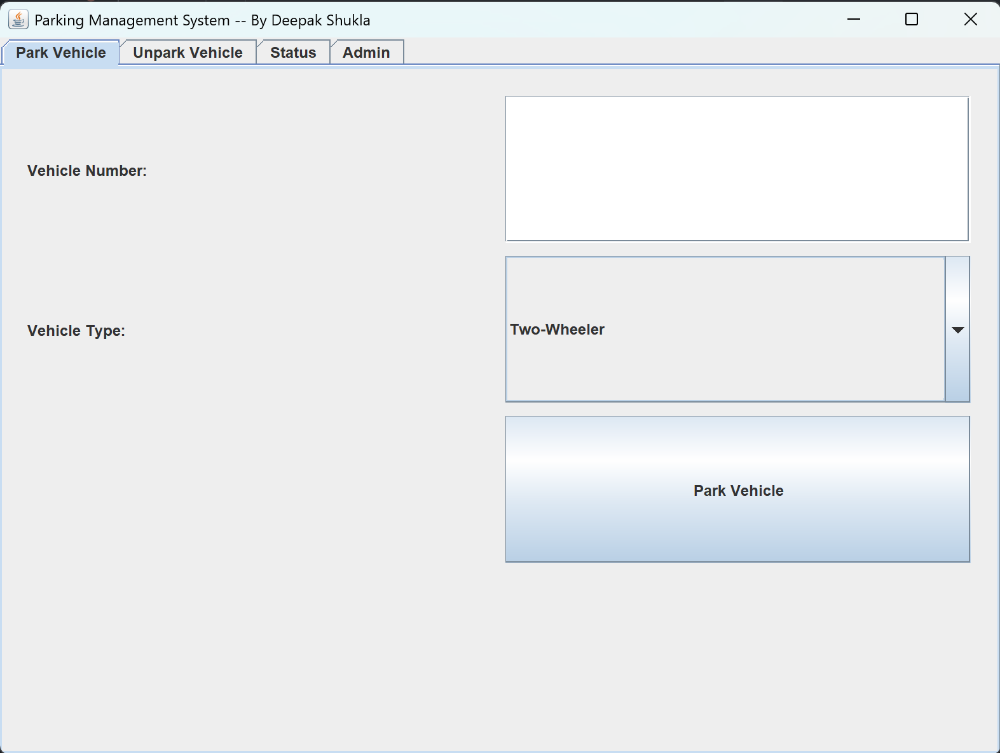

# Parking Management System

## Description
This is a Java-based Parking Management System with a graphical user interface (GUI) built using Swing. It allows users to park and unpark vehicles, check parking status, and view revenue reports.

## Features
- Park different types of vehicles (Two-Wheeler, Three-Wheeler, Four-Wheeler)
- Unpark vehicles with automatic billing calculation
- View parking status with available slots
- Admin features: View revenue, clear revenue history, and exit system

## Installation
1. Clone the repository:
   ```sh
   git clone https://github.com/deepak-158/parking-management-system.git
   ```
2. Open the project in your preferred Java IDE.
3. Ensure Java is installed on your system.
4. Run `ParkingGUI.java` to start the application.

## Usage
- Enter the vehicle number and select the vehicle type to park a vehicle.
- Provide the vehicle number to unpark and calculate charges.
- Admin panel requires a password (`admin123`) to view revenue.

## Java Concepts Used
### Object-Oriented Programming (OOP)
- **Encapsulation:** The system uses classes like `Vehicle`, `Ticket`, and `ParkingLot` to bundle related properties and methods.
- **Inheritance:** The `Vehicle` class can be extended for different vehicle types.
- **Polymorphism:** Methods in `ParkingLot` handle different types of vehicles dynamically.

### Data Structures and Algorithms (DSA)
- **HashMaps & Priority Queues:** Used for managing parking slots and occupied vehicles efficiently.
- **File Handling:** Implements serialization to store and retrieve parking data.
- **Regular Expressions:** Used for vehicle number validation.

## Technologies Used
- **Java Swing** for GUI
- **Java Collections Framework (JCF)** for data management
- **File I/O and Serialization** for data persistence

## Screenshot


## Author
- **Deepak Shukla**

